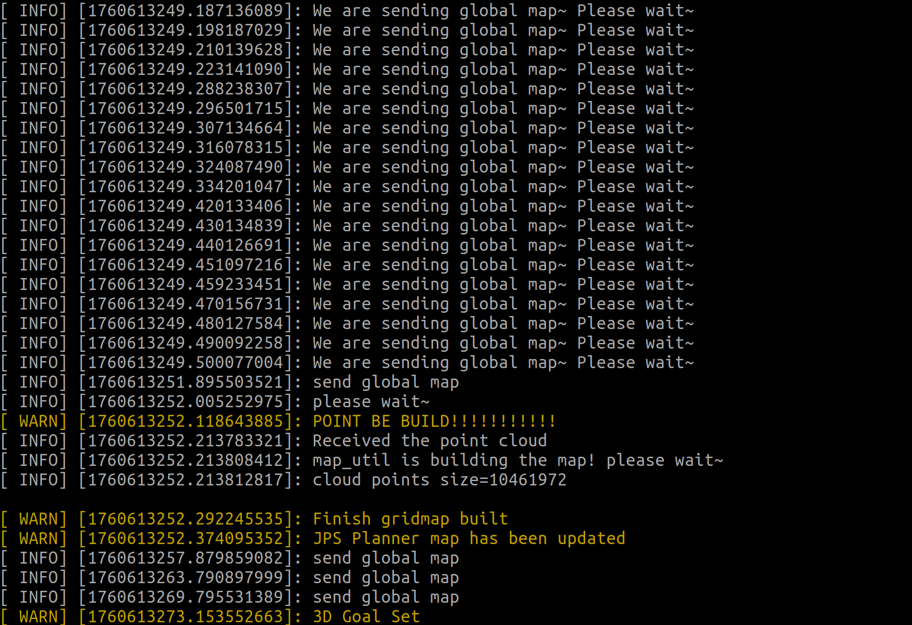
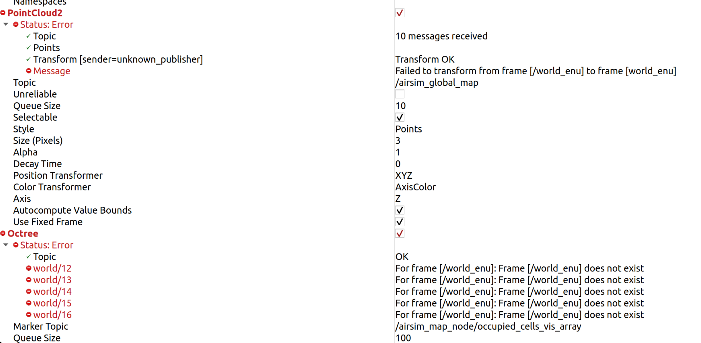
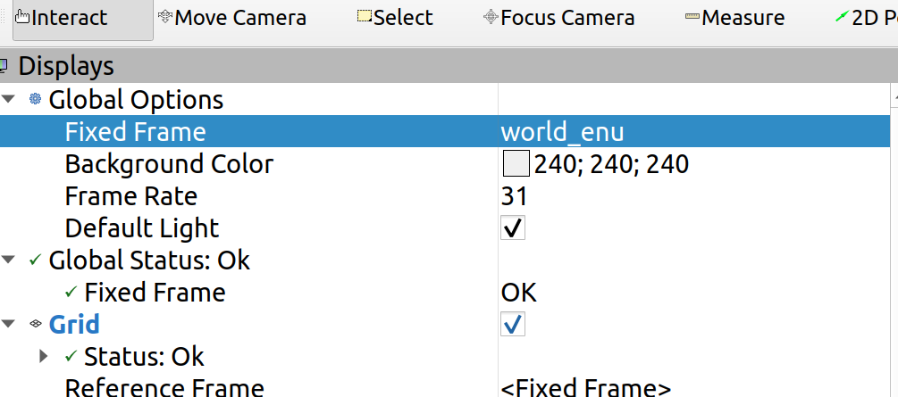

### 编译报错

编译过程的third party报错，因为AirSim的AirLab的MavLinkTest编译好像用的是C++ 17的标准，需要修改MavLinkTest那边的编译规则

Fast-Racing/src/thirdparty/cmake/MavLinkCom/MavLinkTest/CMakeLists.txt

```
LIST(APPEND CMAKE_MODULE_PATH "${CMAKE_CURRENT_LIST_DIR}/../cmake-modules") 
INCLUDE("${CMAKE_CURRENT_LIST_DIR}/../../cmake-modules/CommonSetup.cmake")
CommonSetup()

SetupConsoleBuild()

include_directories(
  ${AIRSIM_ROOT}/MavLinkCom/MavLinkTest
  ${AIRSIM_ROOT}/MavLinkCom/include
  ${AIRSIM_ROOT}/MavLinkCom/common_utils
)

    set(PROJECT_CPP ${PROJECT_NAME}_sources)
    file(GLOB_RECURSE PROJECT_CPP "${AIRSIM_ROOT}/MavLinkCom/${PROJECT_NAME}/*.cpp")
    add_executable(${PROJECT_NAME} ${PROJECT_CPP})
    # ----------add this part -----------
    # Enforce C++17 at target level to avoid being overridden upstream
    set_target_properties(${PROJECT_NAME} PROPERTIES CXX_STANDARD 17 CXX_STANDARD_REQUIRED YES CXX_EXTENSIONS NO)
    target_compile_features(${PROJECT_NAME} PRIVATE cxx_std_17)	
    # ===================================
target_link_libraries(${PROJECT_NAME} ${CMAKE_THREAD_LIBS_INIT} MavLinkCom ${CXX_EXP_LIB})
```

### sh启动脚本

作者写的zhangjiajie.sh的脚本涉及到开启多个roslaunch，可能会出现同时开启多个roscore的情况，会遇到如下报错

```bash
ERROR: Unable to start XML-RPC server, port 11311 is already in use
```

最好换成写一个launch的启动方式，但是作者又设置了sleep

脚本改成这样，先启动roscore, 然后依次启动其他的

```bash
# ensure a single ROS master without races
rosparam get /rosdistro >/dev/null 2>&1 || (roscore & sleep 2);

roslaunch --wait plan_manage zhangjiajie.launch     & sleep 1;
roslaunch --wait traj_server traj_server.launch & sleep 1;
roslaunch --wait Ctrl ctrl_md.launch  & sleep 1;
roslaunch --wait plan_manage visualize.launch;
```

如果可以正常启动，应该是可以看到这样的发送地图的信息

可以看到airsim中飞机会takeoff起来



### rviz中的地图可视化

启动脚本后，rviz中会有地图id不一致的问题

因为作者的版本比较老，新版本的ros已经不流行在根frame_id前加/了



原则上应该修改代码中所有/world_enu的地方，将其改为world_enu

我尝试了，有点问题，会导致飞机乱飞，可能是某些位置不应该改

从其他fork中看，我感觉也许只需要修改traj_server包中的/world_enu

所以换一种思路，只改可视化的部分

修改rviz左上角的global options

将其改为//world_enu

注意双斜杠，因为这里输入的他会默认抹去一个斜杠，这是一种暂时的处理方案，



### 备注

作者的3D nav goal只起到一个启动计算的作用，无论设置goal在哪里，程序都不会接受

作者应该是在代码中写死了goal的位置，并且做了一些配置，要求轨迹一定要穿过预定的gate的位置

设置了goal之后，先算glbal plan, 计算完成后可以在rviz中看到凸包，然后优化轨迹，优化结束之后，飞机才会飞

不知道作者是怎么在airsim的环境中画出gate的，在环境打包之后还能画图吗？